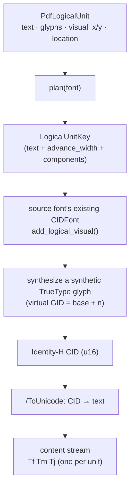

# PDF Logical Units — Version 1 Architecture

> **Enhanced Unicode Engine equivalent:** v0.1.0
> **Krilla revision:** `92cd34f2f9b7ff2d02b7d2b358d7d7a27e3c1dce`

## Overview

Version 1 introduces the core idea that every later logical-unit version is
built on: keep the **exact authored Unicode** of a piece of text separate from
the **shaped glyphs** that paint it.

A PDF producer normally shapes Unicode into positioned glyphs and then writes
only the final glyph IDs. For complex scripts (Khmer clusters, Indic
conjuncts, Arabic contextual forms, emoji ZWJ sequences) shaping merges,
splits, reorders, and substitutes glyphs. Reconstructing the original text from
those final glyph IDs is therefore unreliable.

Version 1 solves the extraction half of that problem. It keeps the logical
Unicode next to the shaped visual representation and writes a `/ToUnicode`
map directly from that preserved text, so copy/paste, search, and
accessibility no longer depend on reverse-engineering glyph IDs.

## The shared public model

Every version uses the same caller-facing unit type:

```rust
pub struct PdfLogicalUnit<'a, G: Glyph> {
    /// Exact Unicode represented by this PDF text unit.
    pub text: &'a str,
    /// Shaped glyphs that visually render this unit, in visual glyph order.
    pub glyphs: &'a [G],
    /// Horizontal pen position of the first glyph, normalized to font size 1.
    pub visual_x: f32,
    /// Vertical pen position of the first glyph, normalized to font size 1.
    pub visual_y: f32,
    /// Optional source location used only for validation diagnostics.
    pub location: Option<Location>,
}
```

The invariants are:

- `text` is authoritative for extraction, search, and accessibility.
- `glyphs` plus the visual origin are authoritative for painting.
- Units are supplied in **logical source order**, even when their visual order
  differs (bidirectional text).
- There is no invisible duplicate text layer and no normal-use `/ActualText`
  fallback.

The caller (the Typst integration) is responsible for shaping, bidirectional
resolution, font fallback, and layout. Krilla receives already-shaped units and
does not reshape, normalize, or apply script-specific rules.

## Version 1 pipeline



## Key components

### `LogicalUnitKey` — one combined key

Version 1 packs everything that identifies a reusable unit into a single key:

```rust
pub(crate) struct LogicalUnitKey {
    pub(crate) text: String,
    pub(crate) advance_width: i32,
    pub(crate) components: Vec<LogicalComponent>,
}
```

`text` is the semantic (extraction) identity, while `advance_width` and
`components` describe the visual geometry. The key deliberately includes
Unicode: two uses of the same source glyph receive different CIDs when they
carry different extraction semantics, and a multi-glyph shaped cluster maps to
one key and ultimately one CID.

```rust
pub(crate) struct LogicalComponent {
    pub(crate) glyph_id: u32,
    pub(crate) x: i32,
    pub(crate) y: i32,
}
```

### `LogicalUnitPlan`

`PdfLogicalUnit::plan()` flattens a unit's shaped glyphs into a plan that is
normalized to the font's units-per-em:

```rust
pub(crate) struct LogicalUnitPlan {
    pub(crate) key: LogicalUnitKey,
    pub(crate) visual_x: f32,
    pub(crate) visual_y: f32,
    pub(crate) location: Option<Location>,
}
```

The `plan()` pass accumulates per-glyph advances and offsets, computes the
unit's tight bounding advance, and rounds component offsets to font units. This
produces a stable, hashable `LogicalUnitKey` that later versions keep reusing
(they only change how it is split and stored).

## How a unit becomes a CID

1. **Plan.** `plan()` turns `PdfLogicalUnit` into a `LogicalUnitPlan`.
2. **Allocate.** The plan's key is handed to the source font's existing
   `CIDFont`. If the key has been seen before, the existing CID is reused;
   otherwise a new synthetic TrueType glyph is synthesized from the visual
   components and assigned a fresh CID.
3. **Synthesize.** `truetype_logical.rs` appends a virtual glyph (a composite
   of the shaped components) to the embedded TrueType font. The virtual GID is
   `base_glyph_count + index`.
4. **Map.** The CID is a standard two-byte `Identity-H` code. `/ToUnicode`
   records `CID → text`.
5. **Paint.** Each unit is emitted into the content stream with its own text
   matrix and `Tj` operator.

## Content-stream emission

Version 1 serializes every unit independently:

```text
Tf  Tm  Tj     Tf  Tm  Tj     Tf  Tm  Tj
```

`set_font`, `set_text_matrix`, and `show` are issued for each unit, so operator
count grows one-to-one with the number of logical units.

## Unicode extraction

`/ToUnicode` is generated from the preserved logical text, not reverse-mapped
from final glyph IDs. This is what makes copy/paste and search correct for
scripts whose shaping destroys glyph-to-character correspondence.

## Properties summary

- Ordinary positioned glyphs and logical units share **one `CIDFont`** per
  source font.
- Unicode and visual data are combined in a single `LogicalUnitKey`.
- One unique semantic-and-visual key consumes one synthetic GID and one CID.
- Each unit is emitted with its own text matrix and `Tj` operation.
- Exact repeated keys reuse their CID.
- There is **no font sharding**.

## Limitations and design cons

These are the problems Version 2 exists to fix:

1. **No semantic/visual separation.** `LogicalUnitKey` bundles `text` with
   `advance_width` and `components`, so the synthetic-glyph builder receives
   Unicode even though it only needs geometry. Extraction text and paint
   geometry are two responsibilities forced into one structure.

2. **Shares the ordinary `CIDFont`.** Logical units are inserted into the same
   `CIDFont` used by regular positioned glyphs, so the two compete for the same
   16-bit glyph/CID namespace.

3. **Hard capacity ceiling.** Available glyph space is
   `65536 - source_font_glyph_count`. A document with enough distinct logical
   units exhausts the namespace and allocation **fails** rather than degrading
   gracefully.

4. **No sharding.** Capacity cannot be extended. There is no mechanism to spill
   into additional fonts, so the 16-bit ceiling is absolute.

5. **Verbose serialization.** Every unit emits its own `Tf Tm Tj` regardless of
   whether adjacent units could have shared font state or text positioning.

## Compatibility and limits

- The synthetic-glyph path requires a TrueType `glyf` font that Krilla can
  synthesize.
- `Identity-H` is the only encoding used; CIDs remain two-byte (`u16`).
- Reader-specific search/highlight behavior is a viewer concern; the producer
  invariant is exact `/ToUnicode` text and valid font mappings.
