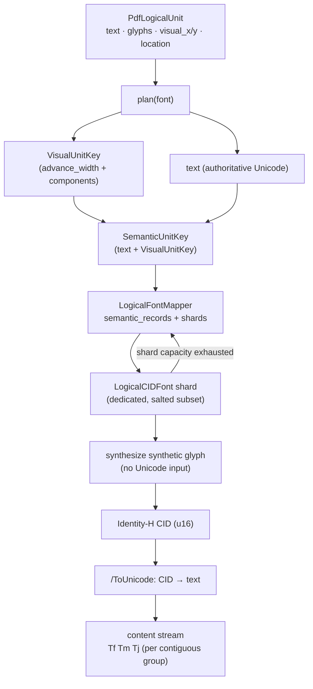

# PDF Logical Units — Version 2 Architecture

> **Enhanced Unicode Engine equivalent:** v0.2.0
> **Krilla revision:** `0cf4da659c6bae966fcec71e26d6d937185c95c9`

## Overview

Version 2 keeps Version 1's logical-unit model and correct `/ToUnicode`
extraction, but moves logical text out of the shared `CIDFont` and into a
dedicated, shardable font mapper. The result removes the 16-bit glyph ceiling
and cleanly separates the two responsibilities that Version 1 conflated.

## What Version 1 got wrong

Version 2 is a direct response to the Version 1 limitations:

1. **`LogicalUnitKey` mixed semantics and geometry.** The synthetic-glyph
   builder received Unicode even though it only needs glyph components.
2. **Logical units shared the ordinary `CIDFont`.** They competed with regular
   glyphs for the same namespace.
3. **Hard capacity ceiling.** Space was capped at
   `65536 - source_font_glyph_count`, and exhausting it caused allocation to
   fail.
4. **No sharding.** There was no way to scale capacity through additional
   fonts.

Version 2 fixes each of these while preserving Unicode identity and painting.

## Version 2 pipeline



## Key components

### `VisualUnitKey` — geometry only

The visual identity of a unit is split out and carries **no Unicode**:

```rust
pub(crate) struct VisualUnitKey {
    pub(crate) advance_width: i32,
    pub(crate) components: Vec<LogicalComponent>,
}
```

This is the input to synthetic glyph construction. Because it contains only
advance and positioned glyph components, the glyph synthesizer never sees text.

### `SemanticUnitKey` — text plus visual key

Reuse identity is decided by combining the exact text with the visual key:

```rust
pub(crate) struct SemanticUnitKey {
    text: String,
    visual: VisualUnitKey,
}
```

Two units reuse a CID only when **both** their Unicode and their visual
representation match. Equal visuals with different Unicode receive different
CIDs, so `/ToUnicode` stays unambiguous.

### `LogicalFontMapper` — the shard owner

Each source font owns a `LogicalFontMapper`, separate from Krilla's ordinary
`CIDFont`:

```rust
pub(crate) struct LogicalFontMapper {
    font: Font,
    semantic_records: FxHashMap<SemanticUnitKey, LogicalPdfGlyph>,
    shards: Vec<LogicalCIDFont>,
    shard_capacity: usize,
}
```

`semantic_records` deduplicates repeated units so exact repeats reuse the same
CID. `shards` holds the actual font subsets.

### `LogicalCIDFont` — one shard

```rust
pub(crate) struct LogicalCIDFont {
    identifier: FontIdentifier,
    cid_font: CIDFont,
    logical_count: usize,
}
```

Each shard has its own PDF font resource and subset identity, distinguished by a
subset salt (`CIDFont::new_logical(font, index)`).

## Font sharding mechanics

When a shard reaches its available TrueType glyph capacity, the mapper creates
another `LogicalCIDFont`:

- capacity is checked before every allocation;
- a full shard causes the mapper to push a fresh shard and allocate from it;
- CIDs and GIDs remain 16-bit and standards-compatible;
- capacity scales through **additional fonts** rather than a non-standard wider
  CID namespace.

This removes Version 1's hard failure mode: exhaustion now produces another
font instead of an allocation error.

## CID reuse rules

| Situation | Result |
|---|---|
| Same text, same visual | one CID (reused) |
| Same visual, different text | different CIDs (unambiguous `/ToUnicode`) |
| Different visual, same text | different CIDs (different paint) |

The ordinary `draw_glyphs` path is unchanged and does not participate in
logical-unit sharding.

## Why not 32-bit character codes?

A prototype separated a four-byte PDF source code from the visual CID through a
custom Encoding CMap. It let different Unicode strings share one visual CID and
enlarged the semantic code space. It produced valid PDF/A and PDF/UA files and
worked in Chromium, Poppler, and other tested readers, but Adobe Acrobat
indexed the real Khmer fixture differently, and it found almost no useful
visual-CID reuse in that document.

The extra mapping layer added interoperability risk without solving a realistic
capacity requirement. Version 2 instead uses ordinary `Identity-H` fonts and
reliable font sharding; there is no `u32` PDF character-code path or custom
Encoding CMap.

## Conservative `Tj` batching

Version 2 reduces operator count where it is provably safe. Adjacent units are
emitted in one `Tj` only when they use the **same shard** and their calculated
geometry is **exactly contiguous**:

```rust
fn is_visually_contiguous_with(&self, next: &Self, upem: f32) -> bool {
    self.tj_adjustment_to(next, upem)
        .is_some_and(|adjustment| nearly_equal(adjustment, 0.0))
}
```

Units with gaps, vertical displacement, transforms, or reordered visual
positions retain separate text matrices. This reduces unnecessary operations
without changing shaped placement or assuming a writing system.

## Properties summary

- Logical text lives in a dedicated `LogicalFontMapper`, not the ordinary
  `CIDFont`.
- Semantic and visual identity are separated into `SemanticUnitKey` and
  `VisualUnitKey`.
- Synthetic glyph construction receives no Unicode.
- Capacity scales through sharding rather than a wider CID namespace.
- Adjacent, exactly-contiguous units batch into a single `Tj`.
- The public `PdfLogicalUnit` API is unchanged from Version 1.

## Limitations and design cons

These are the problems Version 3 exists to fix:

1. **No font-state retention.** Each contiguous group re-emits `Tf` (and `Tm`)
   even when the previous group used the same shard and size. The redundant
   `Tf` operators are pure overhead.

2. **Only exact-contiguity batching.** The sole batching criterion is "the
   adjustment is zero." Any non-zero gap, vertical change, reordering, or shard
   transition forces a new `Tf Tm Tj` group. This is especially wasteful for
   Arabic, where shaping produces many small inter-unit displacements. In the
   measured benchmark fixture this produced 38,207 individually positioned
   groups.

3. **No positioned-array (`TJ`) support in the logical path.** A group can only
   be written as a single `Tj` string, so it cannot express non-zero horizontal
   adjustments inside one text operation. Every gap therefore needs its own
   text matrix.

## Validation

Version 2 is covered by unit tests for:

- exact semantic-unit reuse;
- distinct CIDs for identical visuals with different Unicode;
- deterministic shard creation with an artificial capacity;
- sharding at the actual TrueType glyph limit;
- conservative batching of contiguous horizontal units;
- rejection of batching across gaps, vertical changes, and reordered positions.
