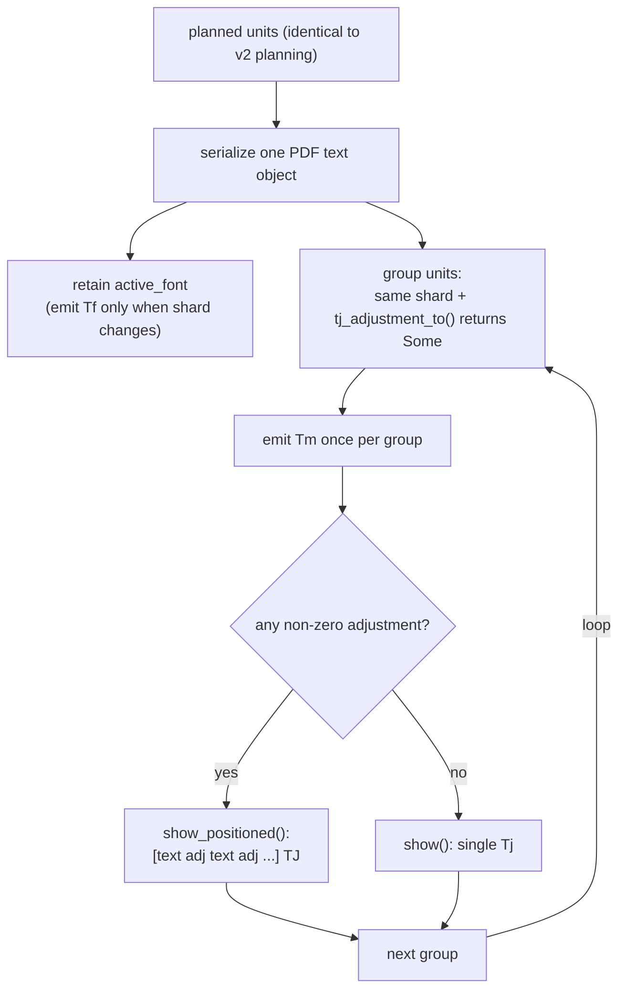

# PDF Logical Units — Version 3 Architecture

> **Enhanced Unicode Engine equivalent:** v0.3.0
> **Krilla revision:** `94d3481150014659ff181fdb9c1163d1d17a40f5`

## Overview

Version 3 keeps Version 2's logical-unit, semantic-CID, and font-sharding
model unchanged. It optimizes **only how already-planned logical units are
written into page content streams**. No Unicode identity, synthetic-glyph
construction, font capacity, or public API changes.

```text
Version 2:  Tf Tm Tj   Tf Tm Tj   Tf Tm Tj
Version 3:  Tf Tm [text adjustment text adjustment text] TJ
```

## What Version 2 got wrong

Version 3 targets the three Version 2 serialization inefficiencies:

1. **No font-state retention.** Each group re-emitted `Tf` even when the shard
   and size were unchanged.
2. **Only exact-contiguity batching.** Any non-zero gap forced a new `Tf Tm
   Tj`, which was catastrophic for Arabic (38,207 groups in the benchmark).
3. **No `TJ` support.** Non-zero horizontal adjustments could not be expressed
   inside one text operation.

## Version 3 pipeline

The planning and font-mapping stages are identical to Version 2; only the
content-stream writer changes:



## Font-state retention

Within one `begin_text()/end_text()` text object, the writer tracks the
currently selected logical-font shard:

```rust
let mut active_font = None;
// ...
if active_font.as_ref() != Some(&first_glyph.identifier) {
    sb.content.set_font(font_name, font_size);
    active_font = Some(first_glyph.identifier.clone());
}
```

`Tf` is emitted only when the shard (or size) changes, eliminating the redundant
`Tf` operators that Version 2 produced for every group.

## `TJ` batching and adjustment math

Units that share a shard and whose positioning can be expressed as a horizontal
adjustment are collected into one positioned `TJ` array. The array keeps
character codes in authoritative logical order and uses numeric adjustments to
reproduce their independently shaped visual positions.

PDF subtracts `TJ` adjustments from the current horizontal text position:

```rust
let expected_x = self.visual_x + self.visual.advance_width as f32 / upem;
let displacement = next.visual_x - expected_x;
let exact_adjustment = -displacement * PDF_UNITS_PER_EM;
```

This makes the adjustment negative for a forward LTR gap and positive when
logical-order text moves backwards visually, as in a right-to-left run. Logical
order is never reordered; only the numeric positioning changes.

### Batching stops when

A group ends at a shard transition, baseline change, invalid coordinate, or any
placement that cannot be expressed safely as a horizontal `TJ` adjustment:

```rust
fn tj_adjustment_to(&self, next: &Self, upem: f32) -> Option<f32> {
    if !nearly_equal(self.visual_y, next.visual_y)
        || !upem.is_finite()
        || upem <= 0.0
    {
        return None;
    }
    // ...
}
```

Tag and marked-content boundaries remain outside this operation and are not
crossed.

## Stable two-decimal positioning

Positioning adjustments are rounded to two decimal places in PDF text space:

```rust
const TJ_PRECISION: f32 = 100.0;
let adjustment =
    (exact_adjustment * TJ_PRECISION).round() / TJ_PRECISION;
```

One text-space unit is one thousandth of the font size, so the maximum rounding
error per adjustment is `0.000005` em. This removes unstable floating-point
tails, improves stream compression, and stays far below display-pixel precision.

## What is unchanged from Version 2

- Unicode identity and logical order.
- `VisualUnitKey` / `SemanticUnitKey` separation.
- `LogicalFontMapper` and `LogicalCIDFont` sharding.
- Synthetic TrueType glyph construction.
- Standard two-byte `Identity-H` CIDs.
- The public `PdfLogicalUnit` API.

Version 3 differs from Version 2 in serialization efficiency only. It remains
the universal logical path for supported fonts; no script-specific or hybrid
routing is required.

## Properties summary

- One `Tf` per text object unless the shard changes.
- `TJ` arrays express forward and backward (`RTL`) horizontal displacements
  without reordering semantic text.
- `Tj` is still used when a group is exactly contiguous.
- Adjustments are rounded to two decimal places (max error `0.000005` em).

## Validation

Version 3 additionally tests:

- forward and backward (`RTL`) `TJ` adjustment signs;
- rejection across incompatible baselines and invalid coordinates;
- stable two-decimal PDF positioning values;
- font-state reuse and shard transitions.

Benchmark results show the effect on operator counts and PDF size, most
notably Arabic dropping from 38,207 positioned groups in Version 2 to a single
`TJ`/`Tj` per text object, with no material compilation-time regression and no
reintroduction of `/ActualText`.
